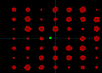



## Asteroid Collisions \(using the DotProduct\)

### Description

Watch Asteroids floating around in space bouncing off each other with the same realistic precision as billiard balls. No DirectX or OpenGL, just pure VB code that produces the most wonderful, mesmerizing zero-G display. This application builds on two of my previous submissions, namely the Asteroids game, and the DotProduct demonstration. It would be trivial to turn this into a 2D game of billiards. It’s also easy to change the shape of the asteroids into perfect speheres by adjusting variables in the “CreateRandomShapeAsteroid” routine. Comments are scattered everywhere throughout the code. As always, compile for speed. Press the space-bar to reset.
 
### More Info
 

             |
---                |---
**Submitted On**   |2004-03-20 16:58:30
**By**             |[Peter Wilson](https://github.com/Planet-Source-Code/PSCIndex/blob/master/ByAuthor/peter-wilson.md)
**Level**          |Intermediate
**User Rating**    |5.0 (35 globes from 7 users)
**Compatibility**  |VB 6\.0
**Category**       |[Graphics](https://github.com/Planet-Source-Code/PSCIndex/blob/master/ByCategory/graphics__1-46.md)
**World**          |[Visual Basic](https://github.com/Planet-Source-Code/PSCIndex/blob/master/ByWorld/visual-basic.md)
**Archive File**   |[Asteroid\_C1722683212004\.zip](https://github.com/Planet-Source-Code/peter-wilson-asteroid-collisions-using-the-dotproduct__1-52536/archive/master.zip)

